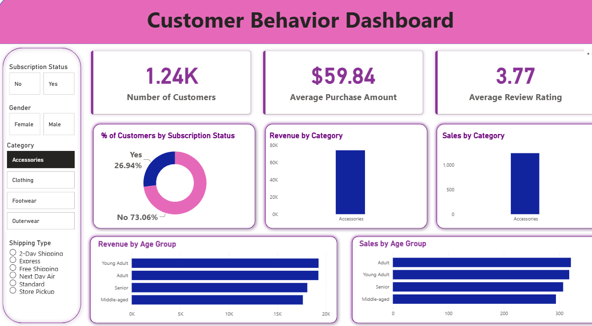

# 🛍️ Customer Shopping Behavior Analysis

## 📌 Project Overview

This project analyzes customer shopping behavior using transactional retail data to uncover valuable business insights. The analysis covers customer demographics, purchasing patterns, product performance, subscription behavior, and revenue trends to support data-driven business decisions.

The project demonstrates an end-to-end Data Analytics workflow using **Python, PostgreSQL, SQL, and Power BI**.

---

## 🎯 Business Problem

A retail company wants to understand customer purchasing behavior to improve sales, customer engagement, and long-term loyalty.

The objective is to identify trends, customer segments, and business opportunities that can help optimize marketing strategies and increase revenue.

---

## 🛠️ Tech Stack

* Python
* Pandas
* NumPy
* PostgreSQL
* SQL
* Power BI
* Jupyter Notebook

---

## 📂 Project Structure

```text
Customer-Shopping-Behavior-Analysis/
│
├── data/
│   └── customer_shopping_behavior.csv
│
├── notebooks/
│   └── Customer_Shopping_Behavior_Analysis.ipynb
│
├── sql/
│   └── customer_behavior_sql_queries.sql
│
├── dashboard/
│   ├── customer_behavior_dashboard.pbix
│   └── dashboard.png
│
├── docs/
│   ├── Customer Shopping Behavior Analysis.pdf
│   └── Business Problem Document.pdf
│
├── presentation/
│   └── Customer-Shopping-Behavior-Analysis.pptx
│
└── README.md
```

---

## 📊 Dataset Information

* **Total Records:** 3,900
* **Total Columns:** 18

### Features Include

* Customer Demographics
* Purchase Amount
* Product Category
* Season
* Subscription Status
* Shipping Type
* Review Rating
* Discount Applied
* Previous Purchases
* Purchase Frequency

---

## 🔄 Project Workflow

### 1. Data Cleaning (Python)

* Loaded dataset using Pandas
* Checked missing values
* Filled missing Review Ratings
* Standardized column names
* Created Age Groups
* Created Purchase Frequency features
* Loaded cleaned data into PostgreSQL

---

### 2. SQL Business Analysis

Business questions solved include:

* Revenue by Gender
* High Spending Discount Users
* Top Rated Products
* Shipping Type Comparison
* Subscribers vs Non-Subscribers
* Top Revenue Locations
* Customer Segmentation
* Seasonal Purchase Analysis
* Payment Method Analysis
* Category-wise Customer Ratings
* Repeat Customer Analysis
* Revenue by Age Group

---

### 3. Interactive Power BI Dashboard

Dashboard includes:

* KPIs
* Revenue Analysis
* Customer Segmentation
* Product Performance
* Subscription Analysis
* Shipping Analysis
* Interactive Filters
* Business Insights

---

## 📈 Key Business Insights

* Female customers generated slightly higher revenue than male customers.
* Subscription customers spent more on average than non-subscribers.
* Express shipping customers showed higher average purchase values.
* Loyal customers contributed significantly to overall revenue.
* High-rated products demonstrated strong customer satisfaction.
* Customer segmentation identified opportunities to improve retention and repeat purchases.

---

## 💡 Business Recommendations

* Increase subscription adoption through exclusive benefits.
* Launch loyalty programs for repeat customers.
* Promote high-performing products.
* Target marketing campaigns toward high-value customer segments.
* Improve customer retention using personalized offers.

---

## 📷 Dashboard Preview



---

## 🚀 Skills Demonstrated

* Data Cleaning
* Exploratory Data Analysis (EDA)
* SQL Query Writing
* PostgreSQL Database Management
* Business Analysis
* Data Visualization
* Dashboard Development
* Business Intelligence
* Data Storytelling

---

## 📁 Repository Contents

* Dataset
* Jupyter Notebook
* SQL Queries
* Power BI Dashboard
* Business Report
* Project Presentation

---

## 👨‍💻 Author

**Anant Jain**

Aspiring Data Analyst passionate about transforming raw data into meaningful business insights using Python, SQL, PostgreSQL, and Power BI.

---

## ⭐ If you found this project useful, consider giving it a Star!
